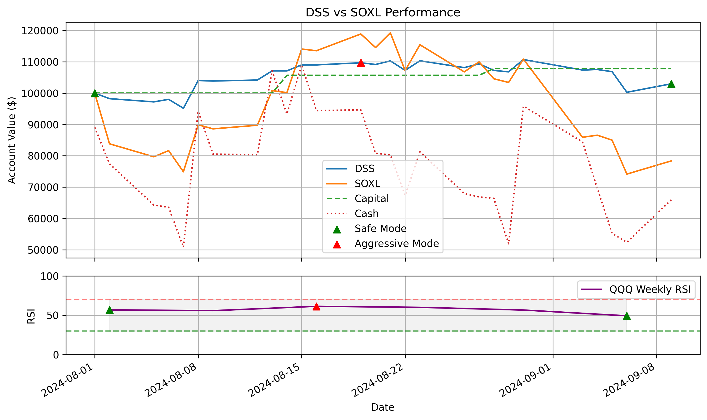

# SOXL에 대한 LOC 주문 및 매개변수 - 2024-09-17

# 일일 요약

- **오늘의 모드:** aggressive
- **현재 계좌 평가액:** $110164.98
- **사용 가능 현금:** $96078.90

## 주문

| 유형 | 가격 | 수량 | 기한 | 매수일 | 매수가격 | 매수모드 |
|------|------|------|------|--------|----------|----------|
| SELL LOC | 32.96 | 438 | 2024-09-24 | 2024-09-16 | 32.16 | 공세 |
| BUY LOC | 33.77 | 455 | 오늘 | - | - | - |

## 모든 매개변수

- **종목:** SOXL
- **RSI ETF:** QQQ
- **안전 모드 매개변수:** (7, 30, 3, 0.2)
- **공격적 모드 매개변수:** (7, 7, 5, 2.5)
- **초기 자본:** $100000
- **이익복리율:** 80.0%
- **손실복리율:** 30.0%
- **수수료율:** 0.02%
- **거래 시작일:** 2024-08-01
- **거래 종료일:** 2024-09-17
- **거래 기간:** 47일

2024-09-17 03:32:39.090627 에 업데이트됨

## DSS 그래프

